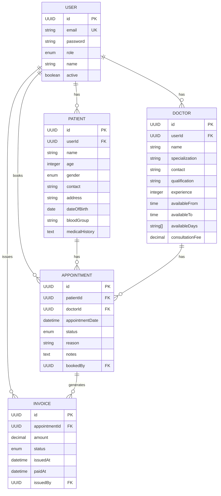

# Entity Relationship Diagram (ERD) - Hospital Management System

## Overview
This document describes the database schema and entity relationships for the Hospital Management System microservices architecture.

## ERD Diagram



## Entity Details

### USER Entity
**Table**: `users`
**Service**: auth-service
**Description**: Central authentication and authorization entity

| Field | Type | Constraints | Description |
|-------|------|-------------|-------------|
| id | UUID | PRIMARY KEY | Unique identifier |
| email | VARCHAR | UNIQUE, NOT NULL | User email (login) |
| password | VARCHAR | NOT NULL | BCrypt hashed password |
| role | ENUM | NOT NULL | User role (ADMIN, DOCTOR, PATIENT, RECEPTIONIST) |
| name | VARCHAR | NULLABLE | User's full name |
| active | BOOLEAN | DEFAULT TRUE | Account status |

**Relationships**:
- One-to-Many with PATIENT (via userId)
- One-to-Many with DOCTOR (via userId)
- One-to-Many with APPOINTMENT (as bookedBy)
- One-to-Many with INVOICE (as issuedBy)

---

### PATIENT Entity
**Table**: `patients`
**Service**: patient-service
**Description**: Patient profile information

| Field | Type | Constraints | Description |
|-------|------|-------------|-------------|
| id | UUID | PRIMARY KEY | Unique identifier |
| userId | UUID | NOT NULL, FK → users.id | Reference to USER |
| name | VARCHAR | NOT NULL | Patient full name |
| age | INTEGER | NULLABLE | Patient age |
| gender | ENUM | NULLABLE | Gender (MALE, FEMALE, OTHER) |
| contact | VARCHAR | NULLABLE | Contact phone number |
| address | TEXT | NULLABLE | Physical address |
| dateOfBirth | DATE | NULLABLE | Date of birth |
| bloodGroup | VARCHAR | NULLABLE | Blood group (e.g., O+, A-) |
| medicalHistory | TEXT | NULLABLE | Medical history notes |

**Relationships**:
- Many-to-One with USER (via userId)
- One-to-Many with APPOINTMENT (via patientId)

---

### DOCTOR Entity
**Table**: `doctors`
**Service**: doctor-service
**Description**: Doctor profile and availability information

| Field | Type | Constraints | Description |
|-------|------|-------------|-------------|
| id | UUID | PRIMARY KEY | Unique identifier |
| userId | UUID | NOT NULL, FK → users.id | Reference to USER |
| name | VARCHAR | NOT NULL | Doctor full name |
| specialization | VARCHAR | NOT NULL | Medical specialization |
| contact | VARCHAR | NULLABLE | Contact phone number |
| qualification | VARCHAR | NULLABLE | Medical qualifications |
| experience | INTEGER | NULLABLE | Years of experience |
| availableFrom | TIME | NULLABLE | Daily availability start time |
| availableTo | TIME | NULLABLE | Daily availability end time |
| availableDays | VARCHAR[] | NULLABLE | Days of week available |
| consultationFee | DECIMAL | NULLABLE | Consultation fee amount |

**Relationships**:
- Many-to-One with USER (via userId)
- One-to-Many with APPOINTMENT (via doctorId)

**Additional Table**:
- `doctor_available_days` - Collection table for availableDays array

---

### APPOINTMENT Entity
**Table**: `appointments`
**Service**: appointment-service
**Description**: Appointment scheduling information

| Field | Type | Constraints | Description |
|-------|------|-------------|-------------|
| id | UUID | PRIMARY KEY | Unique identifier |
| patientId | UUID | NOT NULL, FK → patients.id | Reference to PATIENT |
| doctorId | UUID | NOT NULL, FK → doctors.id | Reference to DOCTOR |
| appointmentDate | TIMESTAMP | NOT NULL | Appointment date and time |
| status | ENUM | NOT NULL, DEFAULT 'BOOKED' | Appointment status |
| reason | VARCHAR | NULLABLE | Appointment reason |
| notes | TEXT | NULLABLE | Additional notes |
| bookedBy | UUID | NOT NULL, FK → users.id | User who booked appointment |

**Relationships**:
- Many-to-One with PATIENT (via patientId)
- Many-to-One with DOCTOR (via doctorId)
- Many-to-One with USER (as bookedBy)
- One-to-Many with INVOICE (via appointmentId)

**Status Values**:
- BOOKED - Initial booking state
- CONFIRMED - Confirmed by doctor
- CANCELLED - Cancelled appointment
- COMPLETED - Appointment completed
- RESCHEDULED - Appointment rescheduled

---

### INVOICE Entity
**Table**: `invoices`
**Service**: billing-service
**Description**: Billing and invoice information

| Field | Type | Constraints | Description |
|-------|------|-------------|-------------|
| id | UUID | PRIMARY KEY | Unique identifier |
| appointmentId | UUID | NOT NULL, FK → appointments.id | Reference to APPOINTMENT |
| amount | DECIMAL | NOT NULL | Invoice amount |
| status | ENUM | NOT NULL, DEFAULT 'PENDING' | Invoice status |
| issuedAt | TIMESTAMP | NOT NULL | Invoice issue timestamp |
| paidAt | TIMESTAMP | NULLABLE | Payment timestamp |
| issuedBy | UUID | NOT NULL, FK → users.id | User who issued invoice |

**Relationships**:
- Many-to-One with APPOINTMENT (via appointmentId)
- Many-to-One with USER (as issuedBy)

**Status Values**:
- PENDING - Invoice pending payment
- PAID - Invoice paid
- OVERDUE - Payment overdue
- CANCELLED - Invoice cancelled

---

## Enumerations

### UserRole Enum
- `ADMIN` - System administrator
- `DOCTOR` - Medical doctor
- `PATIENT` - Hospital patient
- `RECEPTIONIST` - Front desk receptionist

### Gender Enum
- `MALE`
- `FEMALE`
- `OTHER`

### AppointmentStatus Enum
- `BOOKED`
- `CONFIRMED`
- `CANCELLED`
- `COMPLETED`
- `RESCHEDULED`

### InvoiceStatus Enum
- `PENDING`
- `PAID`
- `OVERDUE`
- `CANCELLED`

---

## Database Distribution Strategy

This system uses a **microservices architecture** where each service manages its own database:

- **auth-service**: `users` table
- **patient-service**: `patients` table
- **doctor-service**: `doctors` table, `doctor_available_days` table
- **appointment-service**: `appointments` table
- **billing-service**: `invoices` table

**Note**: Foreign key relationships are logical only. In a microservices architecture, foreign key constraints are not enforced across service boundaries. Services communicate via:
- **gRPC** for synchronous queries (e.g., validate patient exists)
- **Kafka** for asynchronous events (e.g., appointment created → generate invoice)
- **REST** for external API calls

---

## Indexes

Recommended indexes for performance:

```sql
-- Users table
CREATE INDEX idx_users_email ON users(email);
CREATE INDEX idx_users_role ON users(role);

-- Patients table
CREATE INDEX idx_patients_user_id ON patients(userId);

-- Doctors table
CREATE INDEX idx_doctors_user_id ON doctors(userId);
CREATE INDEX idx_doctors_specialization ON doctors(specialization);

-- Appointments table
CREATE INDEX idx_appointments_patient_id ON appointments(patientId);
CREATE INDEX idx_appointments_doctor_id ON appointments(doctorId);
CREATE INDEX idx_appointments_date ON appointments(appointmentDate);
CREATE INDEX idx_appointments_status ON appointments(status);

-- Invoices table
CREATE INDEX idx_invoices_appointment_id ON invoices(appointmentId);
CREATE INDEX idx_invoices_status ON invoices(status);
```

---

## Data Flow Relationships

1. **User Registration Flow**:
   - Create USER in auth-service
   - Create PATIENT or DOCTOR profile based on role

2. **Appointment Booking Flow**:
   - Create APPOINTMENT (validates PATIENT and DOCTOR via gRPC)
   - Publishes Kafka event: `APPOINTMENT_BOOKED`
   - Billing service consumes event → creates INVOICE
   - Notification service consumes event → sends email

3. **Invoice Generation Flow**:
   - Triggered by `APPOINTMENT_BOOKED` event
   - Fetches doctor consultation fee via gRPC
   - Creates INVOICE linked to APPOINTMENT

---

## Notes

- All primary keys use UUID type for distributed system compatibility
- Timestamps use LocalDateTime/LocalDate for timezone handling
- Soft deletes can be implemented using `active` flag in USER entity
- Audit fields (createdAt, updatedAt) can be added using JPA auditing

